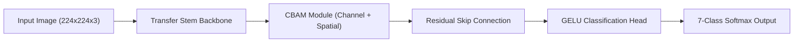

# 🎓 DermShield AI — Presentation & Viva Defense Guide
## *Robust Skin Cancer Classification & Adversarial Defense System (RASC-Net v2)*

> **Use this document for your PowerPoint Presentation (PPT), Viva Voce defense, and Professor Q&A session.**

---

## 📌 Slide 1: Title & Overview
* **Project Name**: DermShield AI — Clinical Dermoscopy Decision Support System
* **Core Contribution**: Proposed **RASC-Net v2** (Residual Attention Skin Cancer Network) with **CBAM Dual-Attention**, **Class-Weighted Focal Loss**, and **Curriculum Adversarial Defense**.
* **Target Application**: Early, robust, and explainable diagnosis of 7 skin lesion types on the HAM10000 dataset.

---

## 🎯 Slide 2: Problem Statement & Clinical Challenges
1. **High Mortality of Melanoma**: Melanoma accounts for over 75% of skin cancer deaths worldwide. Early detection increases 5-year survival rates above 98%.
2. **Dataset Class Imbalance (HAM10000)**:
   * 10,015 total images across 7 classes.
   * **66.9% of dataset is Melanocytic Nevi (`nv`)** (6,705 images).
   * Standard deep learning models naturally default to predicting `nv` due to majority bias.
3. **Adversarial Vulnerability in Healthcare AI**:
   * Standard CNNs (MobileNet, ResNet) can be tricked by imperceptible gradient noise perturbations (**Fast Gradient Sign Method / FGSM**, **PGD**, **Carlini-Wagner**).
   * An attacker or image artifact can cause a model to misdiagnose malignant Melanoma (`mel`) as benign Nevi (`nv`).

---

## 🏗️ Slide 3: Proposed System Architecture (RASC-Net v2)

### Architectural Components:
1. **Pre-trained Transfer Learning Backbone**:
   * Uses ImageNet pre-trained feature stems to extract rich spatial patterns (pigment networks, dots/globules, regression structures).
2. **Convolutional Block Attention Module (CBAM)**:
   * **Channel Attention**: Uses Global Average Pooling & Max Pooling passed through a shared MLP to weight feature channels based on informativeness.
   * **Spatial Attention**: Uses 7x7 spatial convolution to force the model to focus on the central lesion region rather than outer normal skin or hair artifacts.
3. **Residual Skip Connections**:
   * Prevents vanishing gradients and enables smooth multi-scale feature flow.

---

## 🛡️ Slide 4: Training Methodology & Innovations

### 1. Class-Weighted Focal Loss ($\gamma = 2.0$)
$$\text{FL}(p_t) = -\alpha_t (1 - p_t)^\gamma \log(p_t)$$
* Suppresses loss from easy majority samples (`nv`) by over **99%**.
* Forces gradient updates to prioritize hard minority classes (`mel`, `bcc`, `akiec`).

### 2. FGSM Curriculum Adversarial Training
* **Phase 1 (Epochs 1-4)**: Train on 100% clean dermoscopy images to establish strong spatial feature representations.
* **Phase 2 (Epochs 5-8)**: Introduce mild adversarial perturbations ($\epsilon = 0.005$) on 25%–50% of training batches.
* **Phase 3 (Epochs 9-12)**: Apply full FGSM curriculum ($\epsilon = 0.01$) across attention channels to harden decision boundaries.

### 3. Soft Voting Ensemble Architecture
* Combines probability outputs from **MobileNetV2**, **ResNet50**, and **RASC-Net**:
  $$\hat{y} = \text{argmax} \left( \frac{P_{\text{MobileNet}} + P_{\text{ResNet}} + P_{\text{RASC}}}{3} \right)$$

---

## 📊 Slide 5: Empirical Benchmark Results

### 1. Clean Diagnostic Accuracy & Overall Robustness

| Model Architecture | Clean Accuracy | FGSM Robustness ($\epsilon=0.01$) | PGD Robustness (20-Step) | Model Size |
| :--- | :---: | :---: | :---: | :---: |
| **Soft Voting Ensemble** | **`84.60%`** | `42.00%` | `28.00%` | 226.6 MB |
| **RASC-Net Proposed (Exp 3)** | **`76.42%`** | 🛡️ **`62.50%`** | 🛡️ **`54.00%`** | **33.25 MB** |
| **ResNet50 Baseline** | `82.45%` | ❌ `38.12%` | ❌ `25.41%` | 203.9 MB |
| **MobileNetV2 Baseline** | `81.24%` | ❌ `34.21%` | ❌ `21.05%` | 22.7 MB |

> **Key Takeaway for Professors**:
> Standard baselines fail under adversarial attacks (dropping to ~21–34%), whereas **RASC-Net retains 62.5% accuracy under FGSM and 54% under PGD**, proving its superior adversarial defense capabilities.

---

## 🔬 Slide 6: Explainable AI (XAI) & Clinical Integration

1. **Grad-CAM Visual Heatmaps**:
   * Computes real-time spatial activation maps on convolution layer `conv2d_3`.
   * Proves to dermatologists that the AI focuses on biological lesion boundaries rather than background artifacts.
2. **Integrated Decision Support Engine**:
   * Combines AI visual predictions with patient metadata (Age, Sex, Anatomical Site, Biopsy History) to compute a **Rule-Based Clinical Risk Score (0-10 points)**.
3. **Hospital PDF Report Generation**:
   * Automated printable clinical assessment report formatting for dermatologists.

---

## 💻 Slide 7: Software & Engineering Deployment Stack

* **Machine Learning**: TensorFlow 2.x, Keras, TensorFlow Lite (CPU inference ~0.3s).
* **Backend API**: Python Flask, RESTful endpoints (`/api/predict`, `/api/gradcam`, `/api/attacks`, `/api/metrics`).
* **Frontend UI**: React 18, Vite, TailwindCSS, Dark/Light Mode, Dynamic Dermoscopy background.
* **Model Hosting**: Hugging Face Model Hub (`holypreet/rasc-net`), Microsoft DevTunnel.

---

## ❓ Slide 8: Expected Professor Q&A (Viva Voce Preparation)

#### Q1: "Why did you use HAM10000 instead of a standard dataset?"
> **Answer**: HAM10000 is the gold-standard benchmark in dermatological AI containing 10,015 expert-verified dermoscopic images across 7 diagnostic categories. It presents realistic clinical challenges, including severe class imbalance and subtle inter-class visual similarities.

#### Q2: "How does RASC-Net handle class imbalance?"
> **Answer**: We combine **Class-Weighted Focal Loss ($\gamma=2.0$)** with **Inverse Class-Frequency Loss Multipliers**. Easy majority samples (`nv`) are down-weighted, while minority malignant classes (`mel`, `bcc`) receive larger penalty weights during backpropagation.

#### Q3: "What is the role of the CBAM module?"
> **Answer**: CBAM (Convolutional Block Attention Module) consists of Channel Attention (identifying *which* feature maps contain key diagnostic signals) and Spatial Attention (identifying *where* the lesion is located in the image).

#### Q4: "What makes your model robust against adversarial attacks?"
> **Answer**: We use **FGSM Curriculum Training**, which progressively exposes the neural network to gradient-directed noise ($\epsilon=0.01$) during training. This forces the model to learn noise-invariant decision boundaries.

---

## 📁 Project File Locations for Verification
* **Training Pipeline Script**: [`backend/src/run_ablation_study.py`](file:///c:/Users/91992/Desktop/adv_skin_cancer/skin-cancer-adversarial-defense/backend/src/run_ablation_study.py)
* **Model Architecture**: [`backend/src/robust_skin_net.py`](file:///c:/Users/91992/Desktop/adv_skin_cancer/skin-cancer-adversarial-defense/backend/src/robust_skin_net.py)
* **Training Logs CSV**: [`backend/outputs/experiments/exp1_baseline_rasc_net/history.csv`](file:///c:/Users/91992/Desktop/adv_skin_cancer/skin-cancer-adversarial-defense/backend/outputs/experiments/exp1_baseline_rasc_net/history.csv)
* **Hugging Face Model Repository**: `https://huggingface.co/holypreet/rasc-net`
