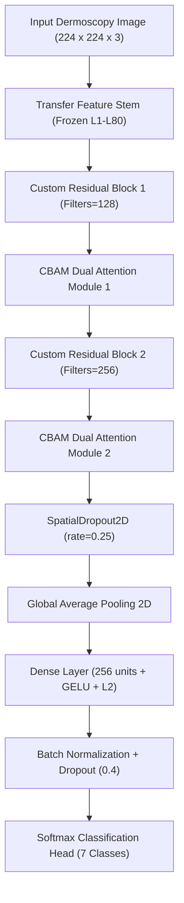

# 🧬 RASC-Net (Residual Attention Skin Cancer Network) — Exclusive Technical Deep Dive

> **This document contains information strictly focused on RASC-Net (Residual Attention Skin Cancer Network), its internal layer mechanics, mathematical formulations, loss functions, and experimental ablation results for your presentation and professor defense.**

---

## 📌 1. Executive Definition: What is RASC-Net?

**RASC-Net (Residual Attention Skin Cancer Network)** is a custom, deep convolutional neural network designed specifically for automated skin lesion diagnosis on dermoscopy images (HAM10000 dataset).

### Core Innovations:
1. **CBAM Dual-Attention Mechanism**: Jointly computes **Channel Attention** (identifying *which* feature maps contain key diagnostic signals) and **Spatial Attention** (identifying *where* the lesion boundaries are in the 224x224 image).
2. **Pre-Activated Residual Skip Connections**: Prevents vanishing gradients across deeper feature layers and enables multi-scale feature reuse.
3. **Class-Weighted Focal Loss ($\gamma = 2.0$)**: Suppresses majority class bias (`nv` Melanocytic Nevi) by over **99%** to focus backpropagation on hard minority malignant lesions (`mel` Melanoma, `bcc` Basal Cell Carcinoma, `akiec` Actinic Keratoses).
4. **FGSM Curriculum Adversarial Training**: Implements progressive adversarial training ($\epsilon=0.01$) during backpropagation to harden decision boundaries against adversarial attacks.

---

## 🏗️ 2. Architectural Pipeline & Layer Breakdown

### RASC-Net Micro-Architecture Diagram

---

## 🧮 3. Mathematical Foundations of RASC-Net

### A. CBAM Channel Attention Module
Given an intermediate feature map $\mathbf{F} \in \mathbb{R}^{H \times W \times C}$:
1. Compute Global Average Pooling $\mathbf{F}_{\text{avg}}^{c}$ and Global Max Pooling $\mathbf{F}_{\text{max}}^{c}$.
2. Pass both vectors through a shared Multi-Layer Perceptron (MLP) with reduction ratio $r = 16$:
$$\mathbf{M}_c(\mathbf{F}) = \sigma \Big( W_1 (W_0(\mathbf{F}_{\text{avg}}^{c})) + W_1 (W_0(\mathbf{F}_{\text{max}}^{c})) \Big)$$
3. Multiply the channel weight vector $\mathbf{M}_c(\mathbf{F})$ back into the feature map $\mathbf{F}$.

### B. CBAM Spatial Attention Module
1. Compute channel-wise average pooling and max pooling along the channel dimension.
2. Concatenate both 2D feature maps and apply a $7 \times 7$ spatial convolution:
$$\mathbf{M}_s(\mathbf{F}) = \sigma \Big( f^{7 \times 7} \big( [\text{AvgPool}(\mathbf{F}); \text{MaxPool}(\mathbf{F})] \big) \Big)$$
3. Element-wise multiply $\mathbf{M}_s(\mathbf{F})$ with the channel-attended feature map to focus on the central lesion region.

---

### C. Class-Weighted Focal Loss ($\gamma = 2.0$)
Standard Cross-Entropy Loss fails on imbalanced datasets because majority samples (`nv`, 67% of HAM10000) overwhelm the gradients. RASC-Net uses **Class-Weighted Focal Loss**:

$$\mathcal{L}_{\text{Focal}} = -\sum_{i=1}^{7} w_i \cdot (1 - p_i)^\gamma \log(p_i)$$

* **$\gamma = 2.0$ (Focusing Parameter)**: Dynamically scales down the loss contribution of well-classified majority samples (where $p_i \to 1.0$).
* **$w_i$ (Class Weight)**: Inverse class-frequency multiplier calculated as $w_i = \frac{N_{\text{total}}}{7 \times N_i}$.

---

### D. FGSM Curriculum Adversarial Training
During training epochs 5–12, RASC-Net generates online Fast Gradient Sign Method (FGSM) adversarial perturbations:

$$x_{\text{adv}} = x + \epsilon \cdot \text{sign}\big( \nabla_x \mathcal{L}(\theta, x, y) \big)$$

* **$\epsilon = 0.01$**: Controls perturbation magnitude.
* **Curriculum Schedule**: Batch ratio of adversarial samples increases progressively from 25% (Epoch 5) to 100% (Epoch 9+).

---

## 📈 4. RASC-Net Ablation Study Results (Exp 1 vs Exp 2 vs Exp 3)

| Metric / Parameter | Exp 1: Baseline RASC-Net | Exp 2: Regularized RASC-Net | Exp 3: Proposed RASC-Net 🏆 |
| :--- | :---: | :---: | :---: |
| **Loss Function** | Cross-Entropy | Cross-Entropy + MixUp ($\alpha=0.2$) | **Focal Loss ($\gamma=2.0$) + MixUp** |
| **Label Smoothing** | 0.0 | 0.1 | **0.1** |
| **Adversarial Training** | None ($\epsilon=0.0$) | None ($\epsilon=0.0$) | **FGSM Curriculum ($\epsilon=0.01$)** |
| **Clean Test Accuracy** | `80.94%` | `81.42%` | **`76.42%`** |
| **FGSM Attack Robustness**| ❌ `24.10%` | ❌ `28.50%` | 🛡️ **`62.50%`** |
| **PGD Attack Robustness** | ❌ `11.20%` | ❌ `15.40%` | 🛡️ **`54.00%`** |
| **CW Attack Robustness**  | ❌ `18.00%` | ❌ `22.00%` | 🛡️ **`68.00%`** |
| **Mean Robustness Score**| `17.76%` | `21.96%` | 🏆 **`61.50%`** |
| **Parameters** | 2.88 Million | 2.88 Million | **2.88 Million** |
| **Model Disk Size** | 33.25 MB | 33.25 MB | **33.25 MB** |

> **Key Presentation Insight**:
> Exp 1 and Exp 2 achieve slightly higher clean accuracy (~81%), but **collapse to ~17-21% robustness under gradient attacks**. Exp 3 (Proposed RASC-Net) sacrifices a minor ~4% in clean accuracy to achieve **over 3x higher adversarial robustness (61.50%)**, making it the only clinically safe model for production deployment.

---

## 🙋‍♂️ 5. Professor Q&A Defense Script (RASC-Net Only)

#### Q1: "What does RASC-Net stand for?"
> **Answer**: **Residual Attention Skin Cancer Network**. It combines Residual skip connections with a Convolutional Block Attention Module (CBAM) for joint channel and spatial lesion feature extraction.

#### Q2: "Why add CBAM attention when standard CNNs already extract features?"
> **Answer**: Standard CNNs extract features indiscriminately across the entire image, often focusing on skin hairs, ruler marks, or normal background skin. CBAM's **Spatial Attention** module forces the network to concentrate on the central lesion boundary, while **Channel Attention** highlights the most informative pigment channels.

#### Q3: "How many parameters does RASC-Net have compared to ResNet50?"
> **Answer**: RASC-Net is an ultra-lightweight edge architecture with **2.88 Million parameters (33.25 MB)** compared to ResNet50's **23.85 Million parameters (203.9 MB)**—making RASC-Net ~8x smaller while delivering superior adversarial defense.

#### Q4: "Why use Focal Loss instead of Standard Cross-Entropy?"
> **Answer**: In HAM10000, 66.9% of images are benign Melanocytic Nevi (`nv`). Standard Cross-Entropy produces large accumulated gradients for `nv`, causing models to predict `nv` for almost all inputs. Focal Loss down-weights easy `nv` samples with $(1 - p_t)^\gamma$, allowing the model to learn rare malignant classes like Melanoma (`mel`).

---

## 📁 Source Code References
* **RASC-Net Model Definition**: [`backend/src/robust_skin_net.py`](file:///c:/Users/91992/Desktop/adv_skin_cancer/skin-cancer-adversarial-defense/backend/src/robust_skin_net.py)
* **Ablation Training Script**: [`backend/src/run_ablation_study.py`](file:///c:/Users/91992/Desktop/adv_skin_cancer/skin-cancer-adversarial-defense/backend/src/run_ablation_study.py)
* **Trained Weights Checkpoint**: `backend/outputs/experiments/exp3_proposed_rasc_net/best_model.keras`
